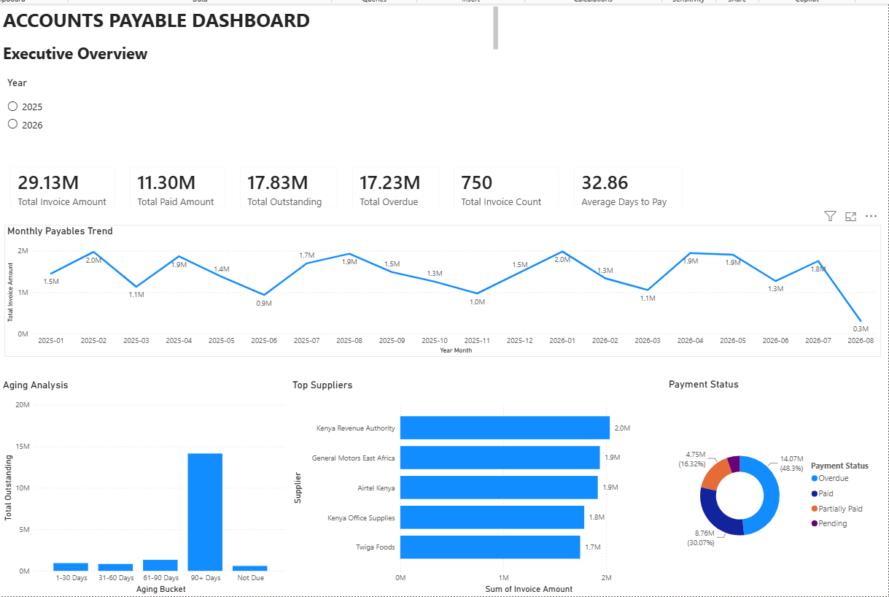

# Accounts Payable Power BI Dashboard

## 📊 Project Overview

An interactive Accounts Payable dashboard developed in Microsoft Power BI to provide visibility into supplier invoices, outstanding balances, payment status, overdue invoices, and invoice aging.

The dashboard is designed to help finance teams monitor accounts payable performance and identify invoices requiring attention.

---

## 🎯 Business Objectives

The dashboard helps answer key Accounts Payable questions:

- How much is currently outstanding?
- How much has been paid?
- How much remains unpaid?
- Which invoices are overdue?
- Which suppliers have the highest outstanding balances?
- How is the outstanding balance distributed by aging?
- Which invoices require immediate attention?

---

## 📌 Key Metrics

The dashboard provides visibility into:

- Total Accounts Payable
- Paid Amount
- Unpaid Amount
- Overdue Amount
- Invoice Count
- Days Due
- Payment Status
- Invoice Aging

---

## 📈 Dashboard Preview



---

## 🔎 Dashboard Features

### Invoice Monitoring

Provides a detailed view of invoices, including invoice dates, due dates, amounts, payment status, and days due.

### Aging Analysis

Helps identify outstanding invoices based on how long they have remained unpaid.

### Supplier Analysis

Allows users to analyse outstanding balances across suppliers and identify areas requiring attention.

### Interactive Filtering

Users can filter the report to investigate specific customers, invoice dates, payment statuses, and other relevant dimensions.

---

## 🛠️ Tools & Technologies

- Microsoft Power BI Desktop
- Power BI Project (`.pbip`)
- DAX
- Power Query
- Microsoft Excel
- GitHub

---

## 📁 Repository Structure

```text
Accounts Payable Dashboard
│
├── Accounts Payable Dashboard.Report
├── Accounts Payable Dashboard.SemanticModel
├── docs/
│   └── dashboard-setup.md
├── accounts-payable-dashboard.png
├── acc. pay. dashboard.pbix
├── Accounts Payable Dashboard.pbip
└── README.md# accounts-payable-powerbi-dashboard
